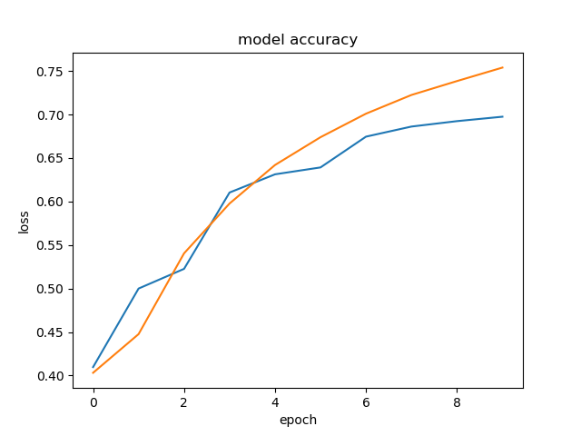
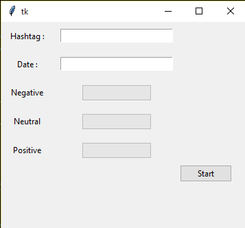

# Twitter-Sentiment-Analysis
Twitter tweets are retrived using tweepy library and given as input for a model trained on twitter sentiment dataset by kaggle. The model used is of the following structure and accuracy.
```
_________________________________________________________________
Layer (type)                 Output Shape              Param #   
=================================================================
embedding (Embedding)        (None, 141, 13)           329303    
_________________________________________________________________
global_average_pooling1d (Gl (None, 13)                0         
_________________________________________________________________
dense (Dense)                (None, 3)                 42        
=================================================================
Total params: 329,345
Trainable params: 329,345
Non-trainable params: 0
_________________________________________________________________
```

Link: https://www.kaggle.com/athirakarthe/sentiment-analysis?scriptVersionId=41986086
<br>This is the link to my kaggle kernel where I have documented the training process in brief.<br>
The model has been used to see the recent sentiment among the twitter population for a given movie or political affair or any hashtag for that matter. The following shows the gui for this usecase.
<br>
